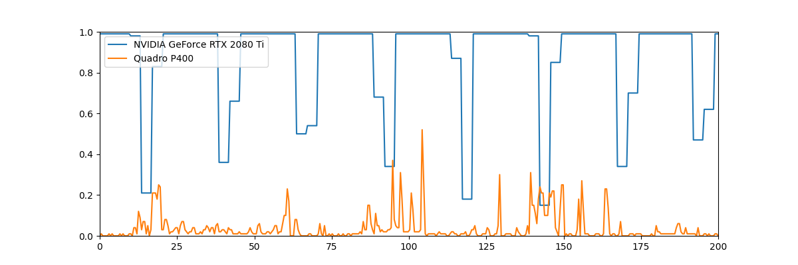

# gpumon
GPU visualization monitor based on GPUutil.

### What does it look like ?

1 line per gpu, showing gpu load (0.0 = 0%, 1.0 = 100%).

### Usage
Create venv and install requirements.
```
python -m venv venv
source venv/bin/activate
pip install -r requirements.txt
```
Run the script.
```
python gpumon.py
```
There are no options or arguments (yet).

### Acknowledgement

this project would not exist without the [GPUutil](https://github.com/anderskm/gputil) library.
The matplotlib animation system is largely inspired by [the following stackoverflow post](https://stackoverflow.com/questions/41133281/better-way-to-implement-matplotlib-animation-with-live-data-from-cpu).